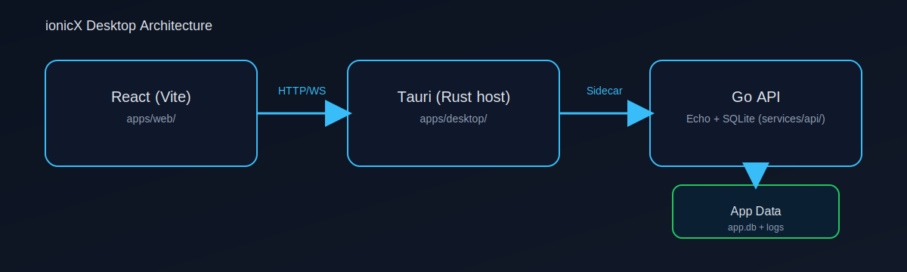
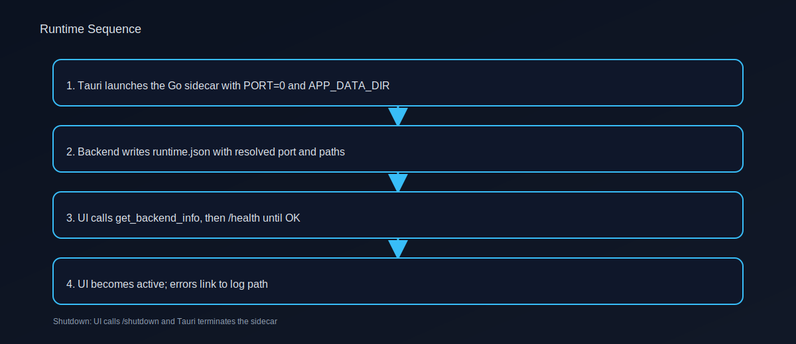
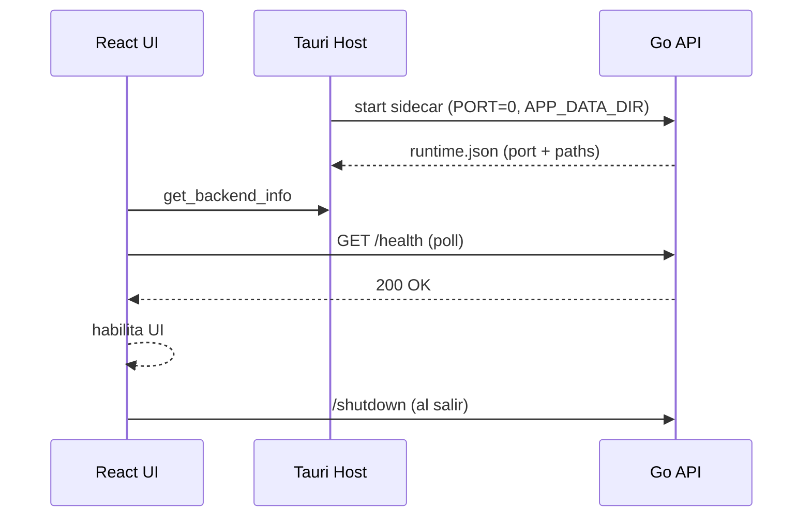
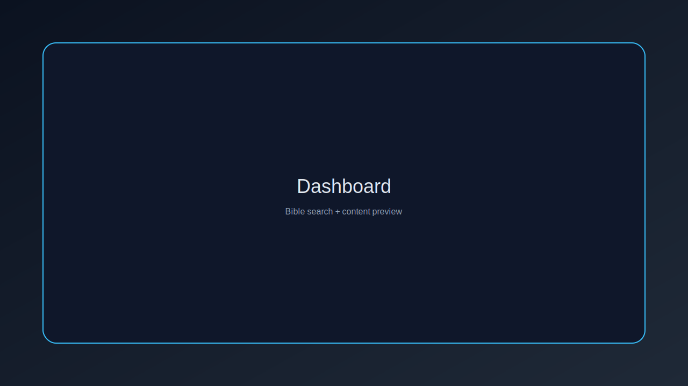
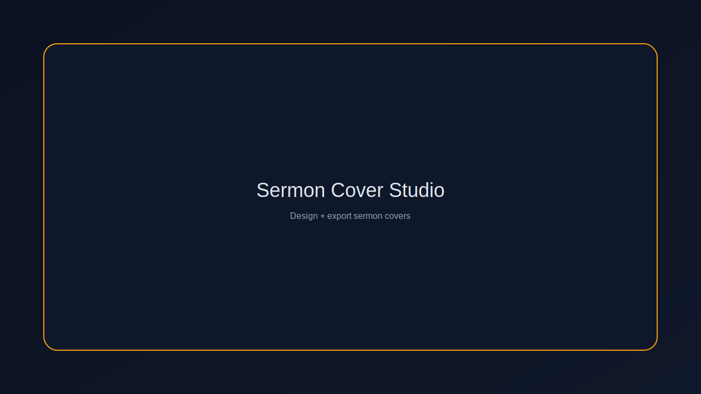
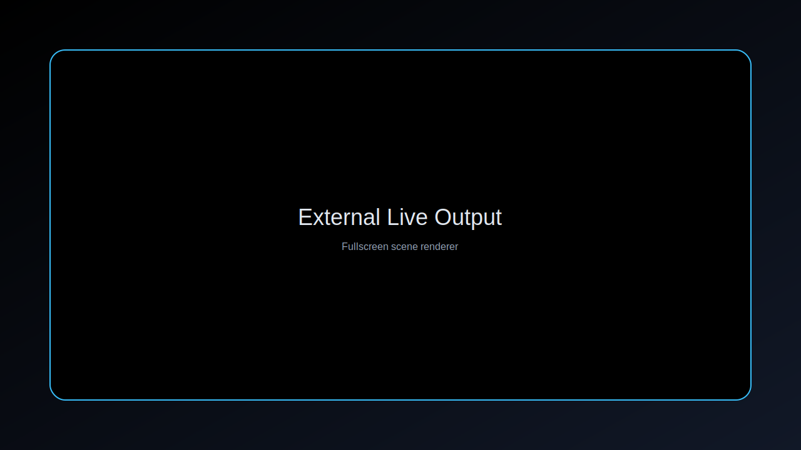

# ionicX

Plataforma de presentaciones en vivo para iglesias: Biblia, letras de canciones, diseño de portadas de prédicas y salida en pantalla completa. Frontend React + backend Go, empaquetado como app de escritorio con Tauri.

## Highlights

- Búsqueda bíblica y envío de versículos al modo en vivo.
- Editor de letras con segmentación y control de escena.
- Estudio de portadas para prédicas con capas, badges e imágenes.
- Salida “External Live” a pantalla completa para proyección.
- Backend local con SQLite y migraciones embebidas.

## Arquitectura



```mermaid
flowchart LR
  A[React (Vite)
apps/web/] -->|HTTP/WS| B[Tauri (Rust host)
apps/desktop/]
  B -->|Sidecar| C[Go API (Echo + SQLite)
services/api/]
  C --> D[(App Data
app.db + logs)]
```

### Runtime





## Screenshots (placeholder)








## Estructura del repo

- `apps/web/` Frontend React + Vite.
- `apps/desktop/` Wrapper Tauri para desktop.
- `services/api/` Backend Go (Echo + SQLite).
- `scripts/` Builders y utilidades.

## Versiones actuales

- Frontend `apps/web`: `0.0.0`
- Desktop (Tauri): `0.1.0`
- Go: `1.21`
- React: `18.3.1`
- Vite: `5.4.1`
- Tauri CLI: `2.0.0`
- Echo: `4.12.0`
- SQLite (modernc): `1.29.0`

## Requisitos

- Node.js 20+
- Go 1.21+
- Rust toolchain estable
- Dependencias Tauri (Linux): `libwebkit2gtk-4.1-dev`, `libayatana-appindicator3-dev`, `librsvg2-dev`, `patchelf`

## Desarrollo

### Web (frontend + backend manual)

1. `cd services/api`
2. `go run ./cmd`
3. `cd ../../apps/web`
4. `npm install`
5. `npm run dev`

### Desktop (Tauri + sidecar)

1. `cd apps/web`
2. `npm install`
3. `npm run dev`
4. En otra terminal: `npm run tauri dev`

## Build

### Backend

```bash
scripts/build-backend.sh
```

### Desktop (todo en uno)

```bash
scripts/build-desktop.sh
```

### Fuentes embebidas

```bash
python3 scripts/fetch-fonts.py
```

Esto descarga las fuentes a `apps/web/public/fonts/` y genera `apps/web/src/fonts.css` y `apps/web/src/constants/fontOptions.ts`.

Los instaladores quedan en:

```
apps/desktop/src-tauri/target/release/bundle/
```

## Datos y logs

- Base de datos: `<APP_DATA_DIR>/app.db`
- Logs: `<APP_DATA_DIR>/logs/ionicx.log`
- `runtime.json` se genera en `<APP_DATA_DIR>` con el puerto real.

Rutas por OS (default):

- macOS: `~/Library/Application Support/ionicX/`
- Windows: `%APPDATA%\\ionicX\\`
- Linux: `~/.local/share/ionicX/`

## Configuración del backend

Variables de entorno:

- `APP_DATA_DIR` Ruta base para DB y logs.
- `PORT` Puerto HTTP (`0` para dinámico).
- `LOG_LEVEL` `debug|info|warn|error`.

Plantilla: `services/api/env-example.yml` (vacía, úsala como base si necesitas).

## Solución de problemas

- La app no conecta al backend: revisar `runtime.json` y logs en `<APP_DATA_DIR>/logs/ionicx.log`.
- En desktop, el puerto es dinámico (`PORT=0`) y la UI espera `GET /health`.
- macOS DMG: si falla `bundle_dmg.sh`, usar `scripts/build-dmg-simple.sh`.

## Notas

- No se usa Docker.
- El backend no escribe dentro del bundle de la app.
- Windows: el instalador incluye WebView2 en modo `offlineInstaller`.

## Licencia

Pendiente de definir.


